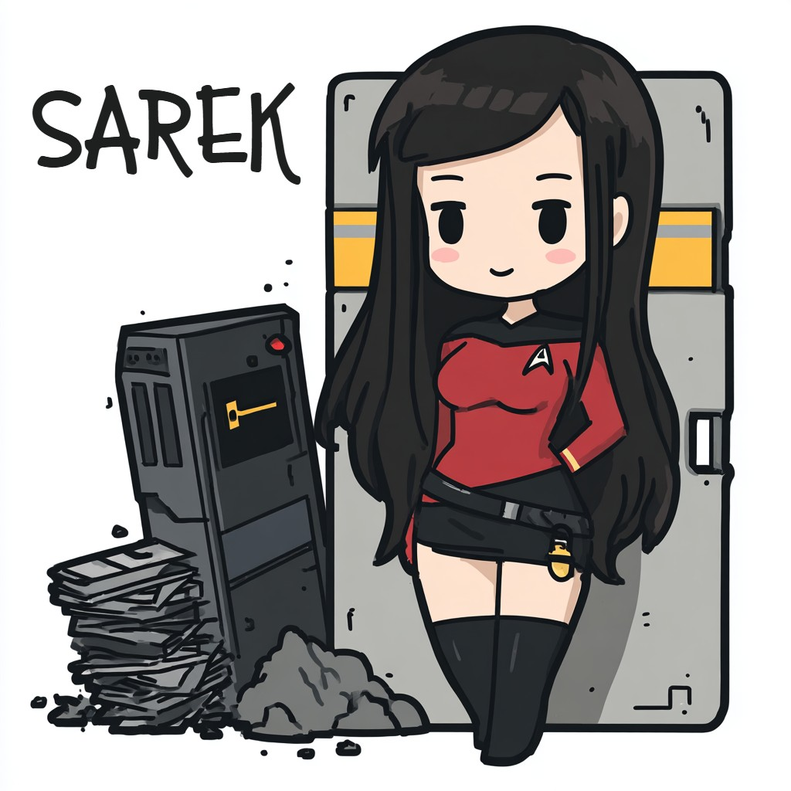

# SAREK Vault Project Website on Github



## What It Is

SAREK is a secrets vault that protects the contents using hybrid (classical+post-quantum) cryptographic algorithms. It's a
practical application that makes use of my [pqc](https://github.com/davesmith10/pqc) library.

### Features

- Written in C/C++ for speed and performance
- Bespoke token authentication, or use OAUTH2/OIDC
- Use our Command-line client (amanda) or Curl to connect to the service API over HTTP
- Industrial strength Berkeley DB backend that scales to millions of records
- multi-user, fully ACID Transactions
- libcrystals (our crypto library) for the heavy lifting

### Who Is This For?

In some regards this project is for me, to write my perfect secrets vault; I used the big name products for years in a professional setting
and was always quite mindful of their flaws. It is also a way to make use of libcrystals, a library built around the idea of the hybrid algorithm.

From the point of view of a business, this project is an experiment, but it could be useful and I have tried to make it useful. It is, as they say,
open source. Everything that I liked about Hashicorp Vault is here: token wrapping, an HTTP API, runs on linux, industrial strength; and yet, 
everything I *didn't* like about Hashicorp Vault is also *not* here: Shamir's secret sharing algorithm at startup (we use linux keyring), 
Consul, and now "Integrated Storage" or RAFT (we use Berkeley DB, the Industrial strength version written in C), the rather clumsy KV Stores
(We use a more flexible system with encrypted nodes that have metadata, mimetypes, and accessors like YAML-extract, JSON-extract, and REGEX-extract), 
and a host of other things, such as additional complexity and an effort to be all things to all people. 

### Is This Secure?

Yes, SAREK is very secure if you take certain precautions in the rest of the stack. For example, the installation should run as a dedicated,
non-privileged user (the scripts expect 'sarek'), and on the client side, the .sarek and .sarekrc files should be chmodded to 0600. IT Security
is only as good as the weakest link, and that is usually somewhere between the chair and the keyboard. 

However, the truth of the matter is that the MIT licence is fairly clear:

```
THE COPYRIGHT HOLDER DISCLAIM ALL WARRANTIES WITH REGARD TO THIS SOFTWARE, INCLUDING ALL IMPLIED WARRANTIES OF MERCHANTABILITY AND FITNESS. 
IN NO EVENT SHALL THE COPYRIGHT HOLDER BE LIABLE FOR ANY SPECIAL, INDIRECT OR CONSEQUENTIAL DAMAGES OR ANY DAMAGES WHATSOEVER RESULTING 
FROM THE LOSS OF USE, DATA OR PROFITS, WHETHER IN AN ACTION OF CONTRACT, NEGLIGENCE OR OTHER TORTIOUS ACTION, ARISING OUT OF OR IN CONNECTION
WITH THE USE OR PERFORMANCE OF THIS SOFTWARE.

```

In other words, you should do your own due diligence. Do testing, submit bug reports, and so on. Like many things in life, you're on your own.


